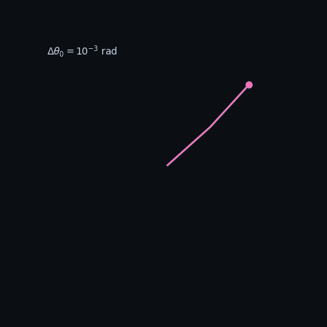
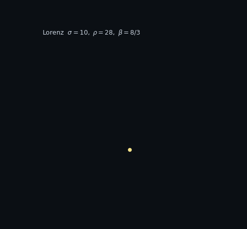
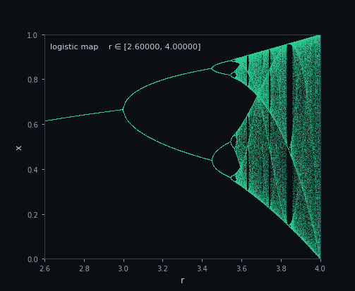
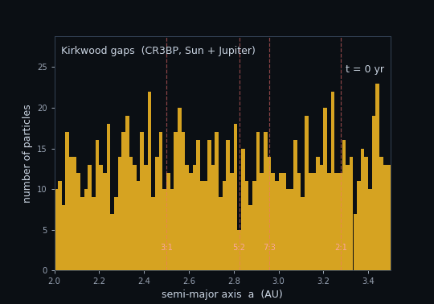

# chaos-playground

Visual reference animations of classic chaotic dynamical systems, rendered
with nothing but NumPy and Matplotlib.

Companion repo to [hnn-double-pendulum](https://github.com/danrixd/hnn-double-pendulum)
(NeurIPS-paper replication on the same physical family). This one is the
breadth — three canonical systems, three GIFs, one reproducible pipeline.

---

## Double pendulum — sensitivity to initial conditions



Two pendulums released from $\theta_1$ and $\theta_1 + 10^{-3}$ rad. Same
bob masses, same rod lengths, same gravity. Within a few seconds the
trajectories are unrecognizable — the Lyapunov-exponent fingerprint of
deterministic chaos.

Equations of motion from the Lagrangian $L = T - V$:

$$
\ddot\theta_1 = \frac{-g(2m_1+m_2)\sin\theta_1 - m_2 g\sin(\theta_1-2\theta_2) - 2\sin(\theta_1-\theta_2) m_2\left(\dot\theta_2^2 \ell_2 + \dot\theta_1^2 \ell_1 \cos(\theta_1-\theta_2)\right)}{\ell_1\left(2m_1+m_2-m_2\cos(2\theta_1-2\theta_2)\right)}
$$

$$
\ddot\theta_2 = \frac{2\sin(\theta_1-\theta_2)\left(\dot\theta_1^2 \ell_1 (m_1+m_2) + g(m_1+m_2)\cos\theta_1 + \dot\theta_2^2 \ell_2 m_2 \cos(\theta_1-\theta_2)\right)}{\ell_2\left(2m_1+m_2-m_2\cos(2\theta_1-2\theta_2)\right)}
$$

Integrated with a 4th-order Runge-Kutta scheme at $\Delta t = 1/600\,\text{s}$.

---

## Lorenz attractor — the original butterfly



Edward Lorenz's 1963 convection model. Three coupled first-order ODEs,
parameters $\sigma = 10,\ \rho = 28,\ \beta = 8/3$. The trajectory is
bounded but never repeats, winding forever around two unstable fixed points.

$$
\dot x = \sigma(y - x), \qquad
\dot y = x(\rho - z) - y, \qquad
\dot z = xy - \beta z
$$

Camera azimuth rotates one full turn across the loop so the 3D shape is
legible in a 2D GIF.

---

## Logistic map — period-doubling into chaos



The simplest system that goes chaotic. A scalar map:

$$
x_{n+1} = r\, x_n\, (1 - x_n)
$$

Scan $r$ from 2.6 to 4.0 and you get a fixed point, then 2 points, then 4,
8, 16, ... at geometrically shrinking intervals (Feigenbaum's $\delta$),
then chaos. The GIF zooms progressively toward the accumulation point near
$r \approx 3.5699$ to expose the self-similarity.

---

## Kirkwood gaps — chaos in the asteroid belt



1200 massless test particles seeded uniformly in semi-major axis across
the main belt, integrated under the planar circular restricted three-body
problem (Sun + Jupiter, test particles massless). As simulation time
advances, resonance-driven chaos pumps eccentricities at the
mean-motion-resonance locations with Jupiter and gaps carve themselves
out of the histogram — the mechanism Wisdom (1982) identified for the
3:1 Kirkwood gap. Visible here at the 3:1 (≈2.50 AU) and 2:1 (≈3.28 AU)
resonances, with partial depletion at 5:2 and 7:3.

Jupiter's mass is inflated by 15× in this run so the effect shows up in
~3000 yr instead of the ~10⁴–10⁶ yr required at the real value — a
didactic acceleration, not a claim about the real solar system. The
resonance locations themselves (set by $a_\text{res} = a_J (q/p)^{2/3}$)
are independent of Jupiter's mass.

Integration is RK4 at $\Delta t = 0.08$ yr, vectorized over all 1200
particles; units are AU and years so that $G M_\odot = 4\pi^2$.

---

## Reproduce

```bash
git clone https://github.com/danrixd/chaos-playground.git
cd chaos-playground
pip install -e .
python -m chaos_playground.double_pendulum.render
python -m chaos_playground.lorenz.render
python -m chaos_playground.logistic.render
python -m chaos_playground.kirkwood.render
```

Each command regenerates its corresponding GIF in `docs/animations/`.

Run the integrator test:

```bash
pip install -e .[dev]
pytest
```

## Layout

```
chaos_playground/
├── shared/integrator.py        RK4, reused by pendulum + Lorenz
├── double_pendulum/            Lagrangian ODE + render
├── lorenz/                     Lorenz 1963 ODE + rotating 3D render
├── logistic/                   Map iterator + progressive-zoom render
└── kirkwood/                   Planar CR3BP + gap-emergence histogram
```

## References

- Lorenz, E. N. (1963). *Deterministic Nonperiodic Flow.* J. Atmos. Sci. 20, 130–141.
- May, R. M. (1976). *Simple mathematical models with very complicated dynamics.* Nature 261, 459–467.
- Wisdom, J. (1982). *The origin of the Kirkwood gaps: a mapping for asteroidal motion near the 3/1 commensurability.* AJ 87, 577–593.
- Goldstein, Poole, Safko. *Classical Mechanics* (3rd ed.), Ch. 1–2.
- Strogatz, S. H. *Nonlinear Dynamics and Chaos*, Westview Press.

## License

MIT. See [LICENSE](LICENSE).
